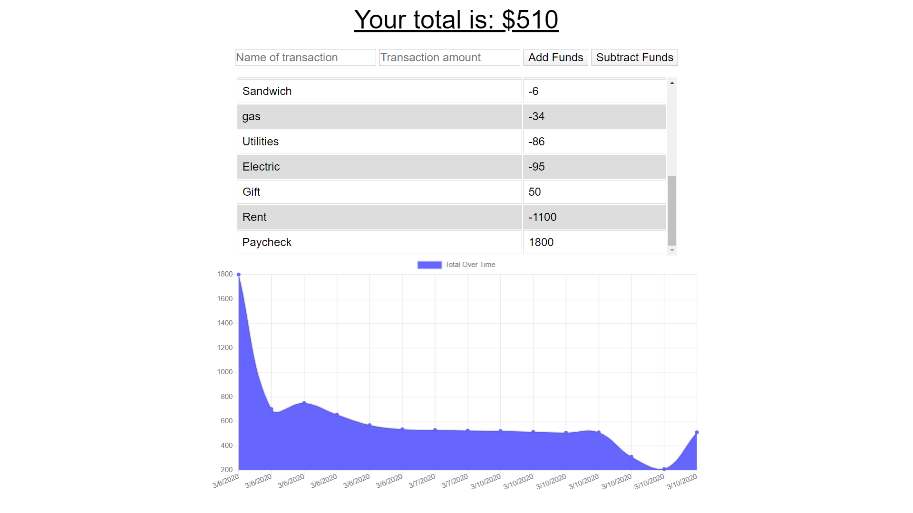

        

# Budgeteer
A budget tracking app with offline capabilities.

#### [Deployed App](https://secure-mountain-84827.herokuapp.com/)

## Concept
AS AN avid traveller
I WANT to be able to track my withdrawals and deposits with or without a data/internet connection
SO THAT my account balance is accurate when I am traveling

## Installation and Usage
1. Install the required modules by typing "npm install" or "npm i" using your code editor terminal; must be at the same level as the package.json.
2. Run the app by typing "node server.js" or "node server."
3. The console log will display " Server listening on: http://localhost:3000 ."
4. You can hold control and click on the address to go directly to the fitness tracker landing page.
5. Add information to the form at the top of the page. When complete, hit add funds or subtract funds depending if this was a deposit or expense.
6. Transactions will be tracked in the table and the chart will display a visual representation of your transaction history.
7. To test the offline capabilities:
    1. Open the developer tools.
    2. Go to network and throttle from Online to Offline
    3. Add any number of transactions.
    4. Transactions are stored in the indexDB
        * dev tools -> Application -> Storage -> IndexDB -> budget -> pending
        * If no transactions are appearing while throttled offline, go to budget and click refresh database.
    5. Return to network and throttle from Offline to Online
    6. Either refresh or add a new transaction.
    7. If you return to the indexDB, there should be no more items stored there.
        * If there are still transactions, go to budget and click refesh database.
    8. Mongo database has been updated with pending transactions.

## Tech Utilized
* HTML
* CSS
* Javascript
* jQuery
* Node
* NPM
* Express
* Fs
* MongoDB
* Mongoose
* IndexDB
* Service Workers

## Future Development
* Add a login sequence. This can add privacy for the user.
* Utilize chart.js more fully by providing various charts for the user. Could add a spending category to form and database allowing user to view their transactions by categories. Could also provide options for user to see their spending patterns.
* Develop an option to create mulitiple budgets/logs so users can track their various accounts.
* Develop a delete and update option. Currently there is no way to delete or update a transaction from the user interface if there is an error. This feature would make this app much more useable.
* Develop a sidebar for a projected budget. This feature works with the categories feature above. User can add a projected budget with various categories. As the user tracks the transactions, columns tack how much of the budget has been used and how much is left. User could adjust budget as needed. 
* New month button. Button will start the tracker over but store the previous transaction list to view later at a later date.
* Add date to the transaction form. Sometimes you don't have time to immediately add a transaction to the list or perhaps your phone died. For this feature the form will include a date option that defaults to current day, but user will have an option to change the date if adding a transaction from another day.

## Credits
Front end code was provided by Trilogy Education Services as part of a homework assignment. 

## License

MIT License

Copyright (c) 2020 Laurie J Schroeder

Permission is hereby granted, free of charge, to any person obtaining a copy
of this software and associated documentation files (the "Software"), to deal
in the Software without restriction, including without limitation the rights
to use, copy, modify, merge, publish, distribute, sublicense, and/or sell
copies of the Software, and to permit persons to whom the Software is
furnished to do so, subject to the following conditions:

The above copyright notice and this permission notice shall be included in all
copies or substantial portions of the Software.

THE SOFTWARE IS PROVIDED "AS IS", WITHOUT WARRANTY OF ANY KIND, EXPRESS OR
IMPLIED, INCLUDING BUT NOT LIMITED TO THE WARRANTIES OF MERCHANTABILITY,
FITNESS FOR A PARTICULAR PURPOSE AND NONINFRINGEMENT. IN NO EVENT SHALL THE
AUTHORS OR COPYRIGHT HOLDERS BE LIABLE FOR ANY CLAIM, DAMAGES OR OTHER
LIABILITY, WHETHER IN AN ACTION OF CONTRACT, TORT OR OTHERWISE, ARISING FROM,
OUT OF OR IN CONNECTION WITH THE SOFTWARE OR THE USE OR OTHER DEALINGS IN THE
SOFTWARE.
